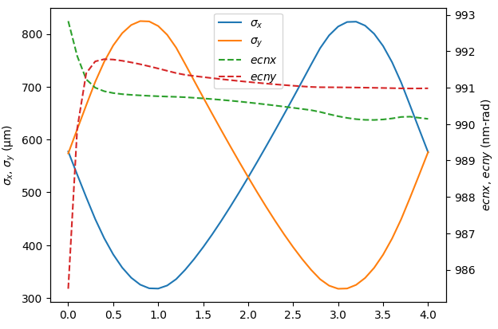
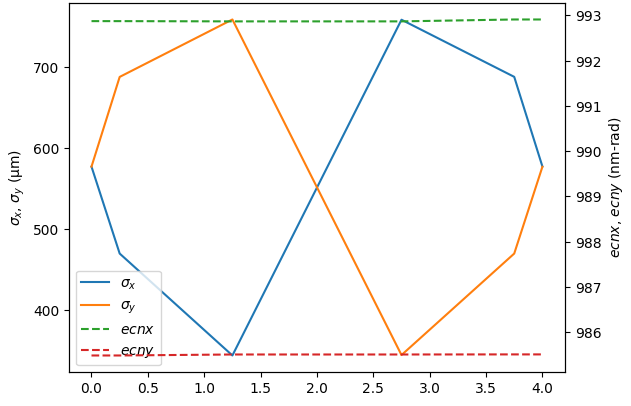

.. _getting-started:

Getting started with SIMBA
==========================

.. _creating-the-lattice-elements:

Lattice Definition
------------------

Accelerator lattices in :mod:`SIMBA` are derived from the `LAURA <https://github.com/astec-stfc/laura/>`_
standard lattice format. This is a schema for providing generic descriptions of accelerator elements and
layouts; see the `LAURA documentation <https://laura-accelerator.readthedocs.io/en/latest/#>`_ for more details.

Given that this format is designed to capture all relevant information about accelerator elements,
and that it includes a built-in translator module for exporting lattice files to various simulation codes,
it can be used within :mod:`SIMBA` for loading, modifying, writing and exporting input and lattice
files for simulation codes.

We would be remiss not to begin with a simple FODO:

.. code-block:: python

    from laura.models.element import Quadrupole, Marker  # noqa E402
    from laura.models.elementList import MachineModel  # noqa E402
    from laura.Exporters.YAML import export_machine
    from laura import LAURA  # noqa E402

    outdir = "/path/to/lattice/directory"

    m1 = Marker(
        name="M1",
        machine_area="FODO",
        hardware_class="Marker",
        physical={
            "middle": {
                "x": 0.0,
                "y": 0.0,
                "z": 0.0,
            }
        }
    )

    # Make some quads and add them to the machine
    q1f = Quadrupole(
        name="QUAD1F",
        machine_area="FODO",
        magnetic={
            "length": 1.0,
            "k1l": -1,
        },
        physical={
            "length": 1.0,
            "middle": {
                "x": 0.0,
                "y": 0.0,
                "z": 0.75,
            },
        },
    )

    q1d = Quadrupole(
        name="QUAD1D",
        machine_area="FODO",
        magnetic={
            "length": 1.0,
            "k1l": 1.0,
        },
        physical={
            "length": 1.0,
            "middle": {
                "x": 0.0,
                "y": 0.0,
                "z": 3.25,
            }
        },
    )

    m3 = Marker(
        name="M3",
        machine_area="FODO",
        hardware_class="Marker",
        physical={
            "middle": {
                "x": 0.0,
                "y": 0.0,
                "z": 4.0,
            }
        }
    )

    sections = {
        "sections": {
            "FODO": ["M1", "QUAD1F", "QUAD1D", "M3"],
        }
    }
    layouts = {
        "default_layout": "line1",
        "layouts": {
            "line1": ["FODO"],
        }
    }

    machine = LAURA(element_list=[m1, q1f, q1d, m3], layout=layouts, section=sections)
    export_machine(path=f"{outdir}/Lattice", machine=machine, overwrite=True)
    
Generating an input beam
------------------------

The simulation requires a macroparticle distribution to run. This can be generated using the 
:ref:`frameworkGenerator <generator-class>` as follows:

.. code-block:: python

    from simba.Codes.Generators imoutdirport frameworkGenerator
    import simba.Modules.Beams as rbf

    gen = frameworkGenerator(
        global_parameters={"master_subdir": outdir},
        filename="M1.openpmd.hdf5",
        initial_momentum=5e6,
        sigma_x=1e-4,
        sigma_px=1e3,
        sigma_y=1e-4,
        sigma_py=1e3,
        sigma_z=1e-3,
        sigma_pz=1e3,
        gaussian_cutoff_x=3,
        gaussian_cutoff_y=3,
        gaussian_cutoff_z=3,
        gaussian_cutoff_px=3,
        gaussian_cutoff_py=3,
        gaussian_cutoff_pz=3,
        charge=100e-12,
    )
    gen.write()
    beam = rbf.beam(filename=f"{outdir}/M1.openpmd.hdf5")
    
Defining the Lattice Simulation
-------------------------------

With the initial beam distribution and lattice now defined, the simulation can be prepared.
This involves passing a group of settings to :mod:`SIMBA`, including:

* The ``files`` to run; this defines the start and end element (or longitudinal position) in the lattice and creates the sections;
* The simulation code used to run each section;
* Additional settings, such as the enabling of collective effects, or transverse matching parameters for the initial beam;
* Settings for beam generation;
* Locations for :mod:`LAURA` files.

These are all read in when :mod:`SIMBA` is instantiated. The example below shows how to create these settings in :mod:`python`;
alternatively, one can create a settings file in YAML and pass that in; see :ref:`Loading a lattice <loading-a-lattice>`:

.. code-block:: python

    from simba.Framework_Settings import FrameworkSettings

    settings = FrameworkSettings()
    files = {}
    for sec, elems in machine.sections.items():
        files.update(
            {
                sec: {
                    "code": "ocelot",
                    "charge": {
                        "space_charge_mode": "False",
                    },
                    "input": {
                        "twiss": {
                            "beta_x": 3.2844606,
                            "alpha_x": 2.48956886,
                            "nemit_x": 1e-6,
                            "beta_y": 3.2846606,
                            "alpha_y": -2.48956886,
                            "nemit_y": 1e-6,
                        },
                    },
                    "output": {
                        "start_element": elems[0].name,
                        "end_element": elems[-1].name,
                    },
                }
            }
        )
    settings.files = files
    settings.layout = machine.layout
    settings.section = {"sections": {name: e.names for name, e in machine.sections.items()}}
    settings.element_list = f"{outdir}/Lattice"

This lattice definition would produce a lattice file (called ``FODO.py``) for running in the **Ocelot** beam tracking code.

If the :mod:`MachineModel` defined above consisted of sequential sections rather than just a FODO, these would then
be added automatically to the tracking.

Running SIMBA
-------------

With everything now prepared, :mod:`SIMBA` can be used to track through the simple FODO lattice.

Note that, in order to run executables (i.e. **ASTRA**, **ELEGANT**) rather than simulation codes based only on 
python (i.e. **Ocelot**, **Cheetah** etc.), the :mod:`SimCodes` directory must be set up; see
:ref:`SimCodes <simcodes>`.

.. code-block:: python

    import simba.Framework as fw
    from simba.Framework import load_directory

    framework = fw.Framework(
        machine=machine,
        simcodes='/path/to/simcodes/',
        directory=f"{outdir}/ocelot",
        clean=True, 
        verbose=True
    )
    framework.loadSettings(settings=settings)
    framework.global_parameters["beam"] = beam
    framework["FODO"].lsc_enable = False
    framework["FODO"].csr_enable = False
    framework.set_lattice_prefix("FODO", "../")

    framework.track()

    fwdir = load_directory(f"{outdir}/ocelot")

    fwdir.plot(xkey="z", ykeys=['sigma_x', 'sigma_y'], ykeys2=["ecnx", "ecny"])
    
Which produces the plot in :numref:`fig-ocelot-fodo`:

.. _fig-ocelot-fodo:

   Output of simple FODO tracking in **Ocelot**
    
The same lattice can also be tracked using a different code as follows:

.. code-block: python

    framework.global_parameters["beam"] = beam
    framework.change_Lattice_Code("FODO", "elegant")
    framework.setSubDirectory(f"{outdir}/elegant")
    framework.track()
    fwdir = load_directory(f"{outdir}/elegant")
    fwdir.plot(xkey="z", ykeys=['sigma_x', 'sigma_y'], ykeys2=["ecnx", "ecny"])
    
Producing the output in :numref:`fig-elegant-fodo`:

.. _fig-elegant-fodo:

   Output of simple FODO tracking in **ELEGANT**
