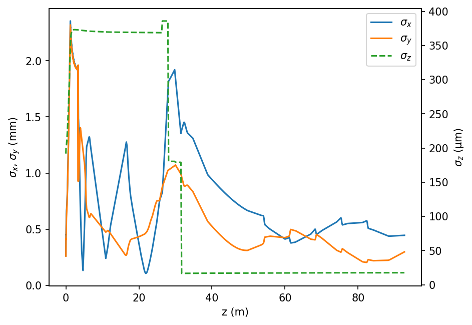

.. _loading-a-lattice:

Loading in a Lattice File
=========================

:ref:`Getting started <getting-started>` demonstrated how to create a
`LAURA <https://github.com/astec-stfc/laura/>`_ lattice in :mod:`python`.
This page describes how to generate a :mod:`SIMBA` instance based on pre-existing
`LAURA <https://github.com/astec-stfc/laura/>`_ element and lattice definitions -- building up
from the simple FODO to a real accelerator lattice, including field maps and collective effects
(space charge, CSR, LSC).

The example on this page uses `JFEL <https://github.com/astec-stfc/laura-lattices/tree/main/JFEL>`_, an
openly available lattice in the `laura-lattices <https://github.com/astec-stfc/laura-lattices>`_ repository,
so that it can be reproduced without access to any private/institutional lattice:

.. code-block:: bash

    git clone https://github.com/astec-stfc/laura-lattices.git

.. _setup-from-file:

Setting up a Simulation From Files
----------------------------------

Given a :mod:`LAURA` ``MachineModel``, which contains:

* All of the elements in an accelerator lattice;
* The various sections that compose that lattice;
* A list of layouts composed of lattice sections;

:mod:`SIMBA` can be used to interact with this structure.

The simulation of the lattice is defined in a separate ``YAML`` file, for example ``jfel_combined.def``
for the JFEL accelerator (found in ``laura-lattices/JFEL/Lattices``):

.. code-block:: yaml

    generator:
        code: astra
        default: jfel_400_3ps
    files:
      injector400:
        code: astra
        charge:
          cathode: True
          space_charge_mode: 2D
          mirror_charge: True
        input:
          particle_definition: 'initial_distribution'
        output:
          zstart: 0
          end_element: JFEL-S02-SIM-APER-01
      Linac:
        code: elegant
        input:
          twiss:
            beta_x: 20
            alpha_x: 0
            beta_y: 10
            alpha_y: 0
        output:
          start_element: JFEL-S02-SIM-APER-01
          end_element: JFEL-FEL-SIM-MARK-01
    groups:
      bunch_compressor:
        type: chicane
        elements: [JFEL-VBC-MAG-DIP-01, JFEL-VBC-MAG-DIP-02, JFEL-VBC-MAG-DIP-03, JFEL-VBC-MAG-DIP-04]
    layout: /path/to/laura-lattices/JFEL/layouts.yaml
    section: /path/to/laura-lattices/JFEL/sections.yaml
    element_list: /path/to/laura-lattices/JFEL/YAML/summary.yaml

This lattice definition produces output files (called ``injector400.in`` and ``Linac.lte``) for running
in the **ASTRA** and **Elegant** beam tracking codes. The magnet and cavity field maps used for these
sections (for example ``HRRG_1D_RF.hdf5`` for the gun cavity) are stored under
``laura-lattices/JFEL/Data_Files`` and referenced from the element YAML files using a ``$master_lattice$``
placeholder, so ``master_lattice`` must point at the ``JFEL`` directory itself for these to resolve
(see below).

The elements are loaded from the file ``/path/to/laura-lattices/JFEL/YAML/summary.yaml`` defined above.

As this simulation starts from the cathode, the ``input`` definition is required for the first
`injector400` ``file`` block. An alternative method for starting is to specify ``input/particle_definition`` to
point to an existing beam file.

For `follow-on` lattice runs, it is sufficient to define the ``output: start_element``, which should match the ``output: end_element`` definition
from the previous ``file`` block -- as is the case for `Linac` here, continuing on from `injector400`.

The ``bunch_compressor`` group defines the four dipoles of the magnetic chicane; :mod:`SIMBA` uses this to
enable coherent synchrotron radiation (CSR) calculations through the chicane when ``csr_enable`` is set
(see below).

Running SIMBA
-------------

The following example assumes that `LAURA <https://github.com/astec-stfc/laura/>`_ has already been installed
(see :ref:`Installation <installation>`) and that the :ref:`SimCodes <simcodes>` directory has
been prepared (either as a local install, or via ``container_runtime="apptainer"``/``"docker"``; see
:ref:`SimCodes <simcodes>`).

.. code-block:: python

    import simba.Framework as fw
    from simba.Framework import load_directory

    # Define a new framework instance, in directory 'example'.
    #       "clean" will empty (delete everything!) in the directory if true
    #       "verbose" will print a progressbar if true
    framework = fw.Framework(
        master_lattice="/path/to/laura-lattices/JFEL",
        directory="./example",
        generator_defaults="jfel.yaml",
        simcodes="/path/to/simcodes/directory",
        clean=True,
        verbose=True,
    )
    # Load the lattice definition file, found in laura-lattices/JFEL/Lattices by default.
    framework.loadSettings("Lattices/jfel_combined.def")
    # This is the code that generates the laser distribution (ASTRA or GPT)
    framework.generator.load_defaults("jfel_400_3ps")
    # Set the thermal emittance for the generator
    framework.generator.thermal_emittance = 0.0005
    # This defines the number of particles to create at the gun (this is "ASTRA generator" which creates distributions)
    # The space charge 3D mesh in ASTRA/GPT performs best if this is a power of 8.
    framework.generator.number_of_particles = 2 ** (3 * 2)
    # Enable collective effects for the Linac section (LSC everywhere, CSR through the bunch compressor)
    framework["Linac"].lsc_enable = True
    framework["Linac"].csr_enable = True
    # Track the injector (cathode start, ASTRA) followed by the Linac (Elegant)
    framework.track(startfile="generator", endfile="Linac")

    fwdir = load_directory("./example")
    fwdir.plot(xkey="z", ykeys=["sigma_x", "sigma_y"], ykeys2=["sigma_z"])

Which produces the plot in :numref:`fig-jfel-linac`, showing the transverse beam size oscillating under
the focusing quadrupoles, and the bunch length dropping sharply as the beam is compressed by the magnetic
chicane around 30 m:

.. _fig-jfel-linac:

   Transverse beam size and bunch length through the JFEL injector and linac, including field maps,
   space charge, and CSR/LSC through the bunch compressor.

Since ``startfile``/``endfile`` select a sub-range of ``framework.lines`` by name, the order of the
``files`` entries in the ``.def`` file (or in :class:`~simba.Framework_Settings.FrameworkSettings`) matters:
they should be listed in the order they are tracked.

Next steps
----------

From here, individual lattice codes can be swapped out (see :func:`~simba.Framework.Framework.change_Lattice_Code`),
collective effects settings can be tuned per-section, and further downstream sections (such as an FEL
undulator line tracked with **Genesis**) can be added in the same way as ``Linac`` above.
